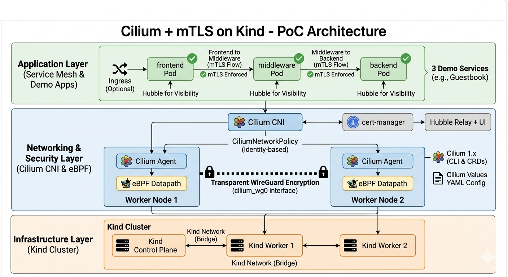

# Cilium mTLS PoC

PoC demonstrating service mesh with mutual TLS using Cilium on local Kind cluster.



## Overview

This PoC demonstrates:
- **eBPF-based networking** with Cilium CNI
- **WireGuard encryption** for node-to-node traffic
- **L3/L4 and L7 network policies** for traffic control
- **Hubble observability** for flow visualization
- **3-tier demo application** (frontend → middleware → backend)

## Prerequisites

- Docker or Colima (macOS)
- Kind
- Cilium CLI (`brew install cilium-cli`)
- Helm
- kubectl

## Quick Start

### One-Command Setup

```bash
# Full setup: cluster + Cilium + encryption + Hubble + demo apps + validation
make all
```

### Step-by-Step

```bash
# 1. Start colima (macOS only)
make start-colima

# 2. Create cluster + install Cilium
make setup

# 3. Enable encryption, Hubble, cert-manager, policies
make setup2

# 4. Deploy demo apps
make setup3

# 5. Validate
make validate
```

## Demo Applications

The PoC includes a 3-tier application:

```
test-pod → frontend → middleware → backend
```

Each service is protected by CiliumNetworkPolicy:
- **frontend**: Accepts traffic from test-pods, allows egress to middleware
- **middleware**: Accepts traffic from frontend, allows egress to backend
- **backend**: Accepts traffic from middleware only

### Test the Demo

```bash
# Generate traffic through all tiers
kubectl run test-demo --image=curlimages/curl --restart=Never -- \
  sh -c "curl -s http://frontend:8080"

# Expected output: "Frontend -> Middleware -> Backend"
```

## Verification

### Check Cluster Status

```bash
# All nodes ready
kubectl get nodes

# Cilium status
cilium status

# WireGuard encryption
make encrypt-status
```

Expected output:
```
Encryption: Wireguard                 
Interface: cilium_wg0
    Public key: ...
    Number of peers: 2
```

### Hubble Observability

```bash
# Port-forward Hubble Relay (run in background)
make hubble-port-forward

# Observe flows
hubble observe --namespace default --last 20

# Or open Hubble UI
cilium hubble ui
```

### Network Policy Validation

```bash
# Test allowed traffic (should succeed)
kubectl run test-allowed --image=curlimages/curl --restart=Never -- \
  curl -s http://frontend:8080

# Test blocked traffic (will be denied)
# Remove allow-all-default policy and try accessing nginx
kubectl delete cnp allow-all-default
kubectl run test-blocked --image=curlimages/curl --restart=Never -- \
  curl -s http://nginx:80
# Should show DENIED in hubble
```

## Make Targets

| Target | Description |
|--------|-------------|
| `make all` | Full setup (all phases + validate) |
| `make setup` | Phase 1: cluster + Cilium |
| `make setup2` | Phase 2: encryption + Hubble + cert-manager |
| `make setup3` | Phase 3: demo apps |
| `make cluster` | Create Kind cluster |
| `make cilium` | Install Cilium |
| `make cilium-encrypt` | Enable WireGuard |
| `make hubble` | Enable Hubble |
| `make cert-manager` | Install cert-manager |
| `make demo-apps` | Deploy demo apps |
| `make deploy` | Alias for demo-apps |
| `make validate` | Run validation script |
| `make verify` | Alias for validate |
| `make status` | Check Cilium status |
| `make encrypt-status` | Check WireGuard encryption |
| `make test` | Run connectivity test |
| `make clean` | Delete cluster |

## Project Structure

```
cilium-mtls-poc/
├── Makefile              # Automation targets
├── kind-config.yaml      # Kind cluster config (1 control + 2 workers)
├── cilium-values.yaml    # Cilium Helm values (WireGuard, Hubble)
├── README.md             # This file
├── docs/
│   ├── plan.md          # Implementation plan
│   └── architecture.png # Architecture diagram
├── manifests/
│   ├── demo-apps/       # Demo app manifests
│   └── network-policies/# CiliumNetworkPolicies
│       ├── default-deny-all.yaml
│       ├── demo-app-policies.yaml
│       └── l7-policies.yaml
└── scripts/
    └── validate.sh       # Validation script
```

## Components

| Component | Version | Purpose |
|-----------|---------|---------|
| Cilium | 1.14.6 | eBPF-based networking & security |
| WireGuard | - | Node-to-node encryption |
| Hubble | - | Observability & flow visualization |
| cert-manager | 1.14.0 | Certificate lifecycle management |
| Kind | 0.16.0 | Local Kubernetes cluster |

## Troubleshooting

### WireGuard shows "Encryption: Disabled"

```bash
# Enable WireGuard explicitly
cilium config set enable-wireguard true

# Check status
make encrypt-status
```

### Hubble UI shows "Waiting for flows"

```bash
# Generate some traffic
kubectl run test --image=curlimages/curl --restart=Never -- \
  sh -c "curl -s http://kubernetes.default.svc"
```

### Pods can't communicate

```bash
# Check network policies
kubectl get cnp -A

# Check hubble for denied traffic
hubble observe --last 20 | grep DENIED

# Check if policy is blocking
kubectl describe cnp <policy-name>
```

## Cleanup

```bash
# Delete the cluster
make clean
```

## Resources

- [Cilium Documentation](https://docs.cilium.io)
- [Cilium Network Policies](https://docs.cilium.io/en/stable/security/network/policy/)
- [WireGuard Encryption](https://docs.cilium.io/en/stable/network/encryption/)
- [Hubble Observability](https://docs.cilium.io/en/stable/observability/hubble/)
